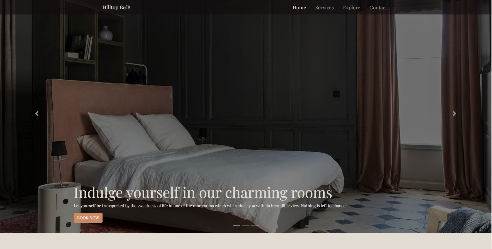

# Hilltop B&B website group project
###### https://elighidiu.github.io/Hilltop-B-B/index.html
###### developed by: Elisabeta, Izidor, Jens, Mari

- Homepage Elisabeta
- Services Jens
- Explore Mari
- Contact Izidor

### Our goal

The idea behind our project was to develop a website for our B&B, in order to attract more guests,
and make reservation more accessible for our customers.
Furthermore, they will get a better look regarding the accommodations and the surroundings.

### The repo's goal
We created this repo, so we can easily collaborate together on the project.

Github provided us version-control, and the possibility to deploy our pages.

